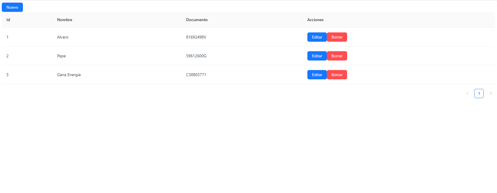
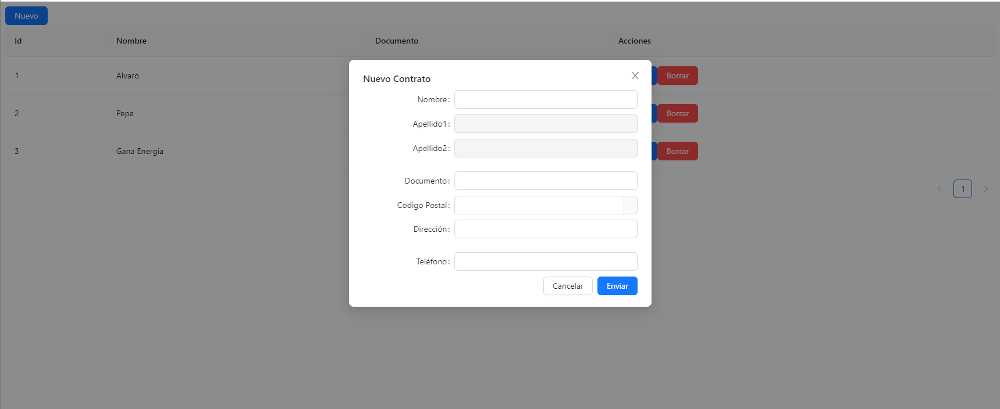
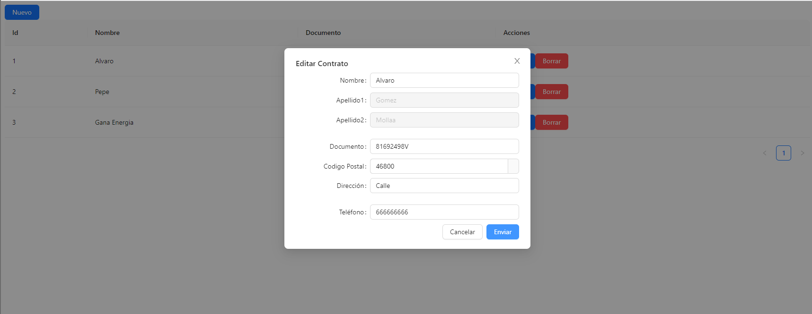

# <center>:bulb: Prueba técnica Gana Energía (FRONTEND) :bulb:</center>

La parte del backend esta en el siguiente [repositorio](https://github.com/alvaroo243/backend_gana).

## :round_pushpin: Índice

- [El proyecto](#el-proyecto)

    - [Instalación y despliegue](#instalacion-y-despliegue)

    - [Tecnologías y packages utilizados](#tecnologías-y-packages-utilizados)

    - [Objetivos](#objetivos)

- [Conclusión](#conclusión)

- [Autor](#autor)

---

# :battery: El proyecto :battery:

Vistas previas del proyecto:







## :bangbang: Instalacion y despliegue

El proyecto estará subido en un repositorio público de GitHub.

Para instalar el frontend del proyecto primero deberas clonar el siguiente repositorio, con el comando git clone:

``` 
git clone
```

Una vez esten clonados los dos, deberas de instalar lo necesario para inicializar el proyecto:

```
npm i
```

Por ultimo para inicializar el frontend del proyecto necesitaras poner el siguiente comando: 

```
npm start
```

Al iniciar el frontend se abrirá una ventana nueva en el navegador predeterminado del equipo.
Cabe añadir que para que funcione todo bien hay que iniciar primero el backend para que se inicie en el puerto 3000, ya que los repositorios estan programados para trabajar en local.

## :computer: Tecnologías y packages utilizados

- JavaScript
- [React](https://es.reactjs.org/)
- [Antd](https://ant.design/)
- [NodeJS](https://nodejs.org/)
- [MongoDB](https://www.mongodb.com/)
- [Axios](https://axios-http.com/)
- [Postman](https://www.postman.com/)

## :dart: Objetivos

Los objetivos del frontend eran:

- Crear una aplicación en React, en la cual se pueda visualizar, borrar, crear y editar contratos.

- Una tabla para mostrar los contratos, y formulario para añadir y editar contratos.

- Validaciones de la información que se introduce en los formularios.

---

# :scroll: Conclusión

Mi frontend al final ha quedado mejor de lo que esperaba, ya que comencé practicamente sin tener ninguna idea de React, y al final he podido trabajar con ello y prácticamente finalizar la prueba. 

Digo prácticamente porque el proyecto no esta bien del todo, tiene fallos en el frontend, a la hora de coger informacion cuando quieres editar un contrato o quieres crear uno nuevo.

Si intentas crear un contrato funciona bien, pero si luego quieres editar uno ya no funciona y viceversa. Si que funciona del todo bien si recargas página cada vez que añadas o edites. Tambien funciona el editar varias veces un contrato.

Pienso que he tenido estos problemas por tener un mal planteamiento de como hacerlo y que cosas utilizar para tener una aplicacion eficiente; todo esto creo que viene porque acabo de comenzar mi aprendizaje sobre estos lenguajes y aun me quedan muchas cosas que aprender.

He de decir también que agradezco haber participado en el frontend esta prueba, ya que me ha ayudado a aprender bastante sobre React.

---

#  :bust_in_silhouette: Autor

- [Álvaro Gómez Mollá](https://github.com/alvaroo243)